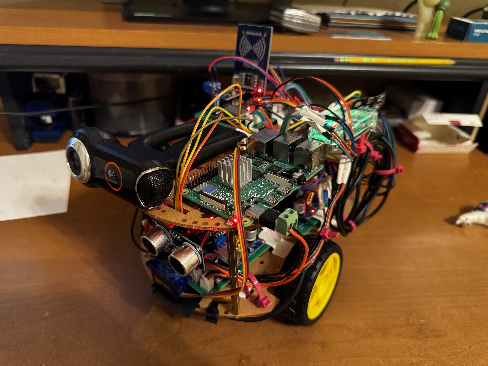
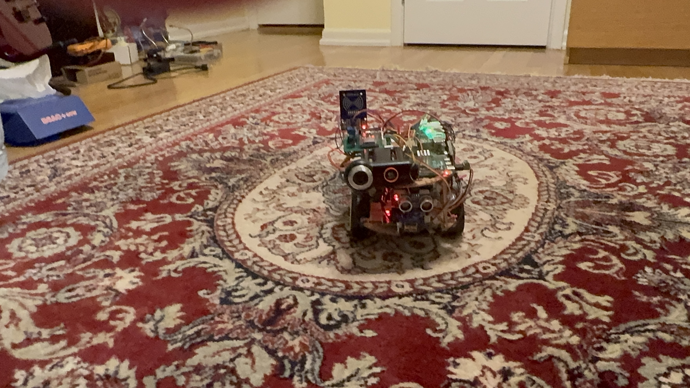
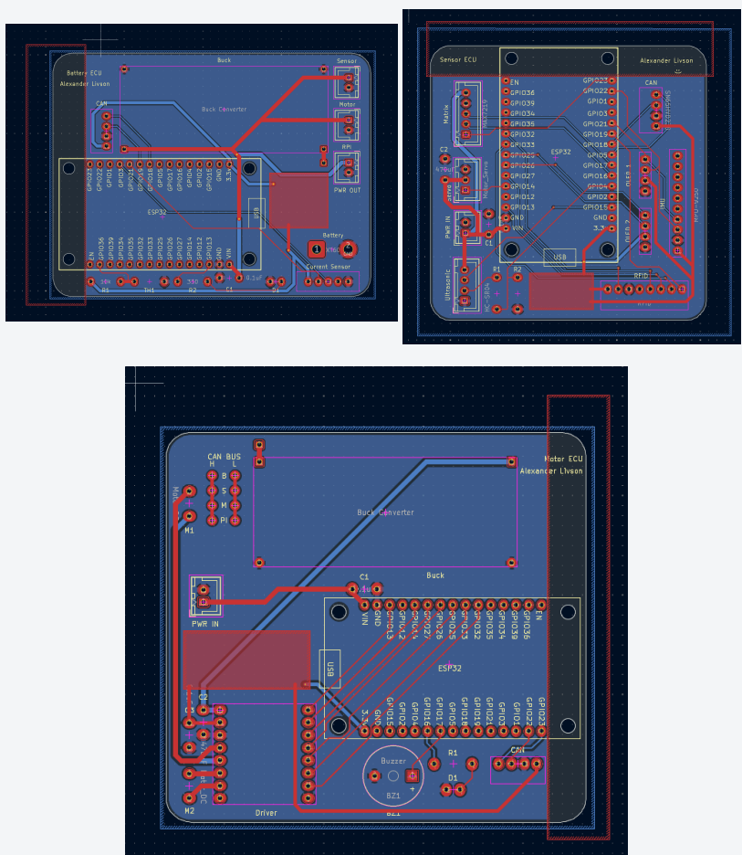
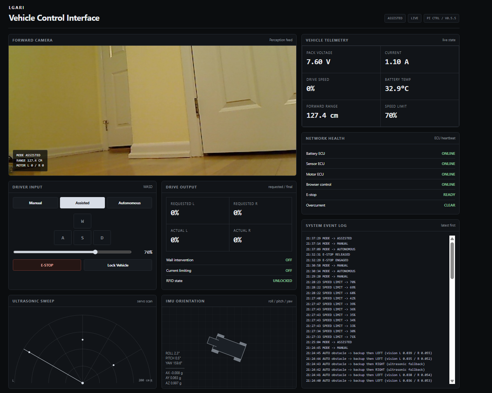

# Distributed Electric Vehicle Control and Autonomy Platform

A small-scale electric vehicle electronics platform built around **three custom ESP32-based ECUs and a Raspberry Pi 4 supervisory controller**, connected through a **500 kbps CAN network**.

The project was built as a hands-on study of automotive embedded systems, custom PCB design, distributed vehicle electronics, safety-oriented control, Raspberry Pi development, and computer vision.



## Demo

[](https://youtu.be/MoWJwQRdX8E)

The demonstration includes manual driving, RFID authorization, assisted collision protection, live vehicle telemetry, and OpenCV-assisted autonomous obstacle avoidance.

---

## Project Overview

The vehicle uses a distributed control architecture similar in concept to a simplified electric vehicle.

Instead of one microcontroller handling the entire system, responsibilities are divided between several networked controllers:

* **Battery ECU** – monitors pack voltage, current, temperature, and battery health
* **Sensor ECU** – manages ultrasonic ranging, servo scanning, IMU telemetry, RFID authorization, OLED displays, and the LED matrix
* **Motor ECU** – controls the left and right drive motors
* **Raspberry Pi 4** – acts as the supervisory vehicle computer, hosts the dashboard, manages safety logic, processes CAN telemetry, and runs OpenCV perception

All four nodes communicate over a shared **500 kbps CAN bus**.

---

## Key Features

* Three custom ESP32 ECU PCBs designed in KiCad
* Four-node 500 kbps CAN network
* Raspberry Pi 4 supervisory vehicle controller
* Browser-based real-time vehicle dashboard
* Manual, Assisted, and Autonomous driving modes
* Whole-vehicle voltage, current, and temperature monitoring
* RFID-based vehicle authorization
* Ultrasonic obstacle detection with servo scanning
* OpenCV-assisted autonomous obstacle avoidance
* IMU acceleration, angular velocity, and orientation telemetry
* Differential motor control
* Emergency-stop functionality
* CAN and browser communication watchdogs
* Distance-based collision protection
* Multi-stage overcurrent protection
* Automatic Raspberry Pi and CAN startup

---

# System Architecture

The architecture separates sensing, power monitoring, motor actuation, and higher-level decision making.

```text
                         Raspberry Pi 4
                    Supervisory Vehicle Computer
                              │
                              │
                       500 kbps CAN Bus
                              │
          ┌───────────────────┼───────────────────┐
          │                   │                   │
     Battery ECU          Sensor ECU          Motor ECU
          │                   │                   │
     INA228 + NTC      Ultrasonic / IMU       TB6612FNG
                            RFID             Dual TT Motors
                         OLED Displays
                          LED Matrix
```

The Raspberry Pi receives telemetry from each ECU, applies supervisory safety rules, and transmits the final motor commands to the vehicle.

---

# Custom ECU Hardware

The electronics were first validated on breadboards and then converted into three custom two-layer PCBs.



## Battery ECU

The Battery ECU monitors the electrical health of the complete vehicle.

Hardware includes:

* ESP32-WROOM-32 development board
* INA228 current and voltage monitor
* 10 kΩ NTC thermistor
* CAN transceiver
* Status LED
* Power-distribution connections

The INA228 is positioned near the beginning of the vehicle power path so current measurement represents the entire system.

---

## Sensor ECU

The Sensor ECU manages most of the vehicle's environmental sensing and local user interface.

It controls:

* HC-SR04 ultrasonic distance sensor
* Microservo for left/center/right scanning
* MPU9250 IMU
* MFRC522 RFID reader
* Two 0.96" 128×64 OLED displays
* MAX7219 8×8 LED matrix
* CAN communication

The ultrasonic sensor continuously provides forward and directional range data used by both the safety system and autonomous driving logic.

---

## Motor ECU

The Motor ECU controls two TT gearmotors through a **TB6612FNG dual motor driver**.

Commands are transmitted as independent signed left and right motor percentages, allowing:

* Forward driving
* Reverse driving
* Differential steering
* In-place turning

The ECU also reports motor status back to the Raspberry Pi over CAN.

---

# PCB Development

All three ECU boards were designed in **KiCad**.

The PCB development process included:

1. Breadboard hardware validation
2. Schematic capture
3. Custom through-hole footprint creation
4. Two-layer PCB layout
5. Ground-plane design
6. Power trace sizing
7. ESP32 antenna keep-out
8. Design Rule Check
9. Fabrication through JLCPCB
10. Hand soldering and hardware bring-up

Typical trace widths were approximately:

* **0.25 mm** for signals
* **0.75 mm** for 3.3 V distribution
* **1.0 mm** for higher-current 5 V paths

The bottom layer was used primarily as a ground plane.

---

# CAN Network

The completed vehicle contains four CAN nodes operating at **500 kbps**.

The Battery ECU and Raspberry Pi are located at the two ends of the physical bus and provide termination.

A powered-off measurement across CAN-H and CAN-L is approximately **60 Ω**, corresponding to two effective 120 Ω terminating resistors.

## CAN Message Map

| CAN ID  | Direction        | Purpose                                            |
| ------- | ---------------- | -------------------------------------------------- |
| `0x100` | Battery ECU → Pi | Battery voltage, current, and temperature          |
| `0x200` | Sensor ECU → Pi  | Sensor status, ultrasonic range, RFID state        |
| `0x201` | Sensor ECU → Pi  | Accelerometer X/Y/Z                                |
| `0x202` | Sensor ECU → Pi  | Angular velocity X/Y/Z                             |
| `0x203` | Sensor ECU → Pi  | Roll, pitch, and yaw                               |
| `0x204` | Sensor ECU → Pi  | Left, center, and right ultrasonic ranges          |
| `0x300` | Motor ECU → Pi   | Motor output and ECU status                        |
| `0x400` | Pi → Vehicle     | Drive command, mode, speed limit, and safety state |
| `0x401` | Pi → Sensor ECU  | Lock/unlock request                                |

Detailed CAN payload definitions are available in the full engineering report.

---

# Raspberry Pi Vehicle Computer

The vehicle computer is a **Raspberry Pi 4 Model B with 1 GB RAM** running Raspberry Pi OS Lite.

The main controller is written in Python and integrates:

* Linux SocketCAN
* Flask
* OpenCV
* Threaded CAN reception
* Safety management
* Vehicle state tracking
* Autonomous decision making
* Browser control
* Camera streaming

The Pi runs a supervisory control loop every **20 ms**, corresponding to approximately **50 Hz**.

CAN and the main vehicle application are configured to initialize automatically when the Raspberry Pi boots.

---

# Web Dashboard



The Raspberry Pi hosts a local browser-based vehicle interface.

The dashboard displays:

* Live forward camera
* Drive mode
* Motor requests and feedback
* Pack voltage
* Pack current
* Battery temperature
* Ultrasonic distance
* Ultrasonic radar visualization
* IMU orientation
* Acceleration
* ECU network health
* RFID lock state
* E-stop state
* Current limiting
* Wall intervention
* System event history

Manual and Assisted driving are controlled using **WASD**, with an adjustable 0–100% speed limit.

---

# Drive Modes

## Manual

Manual mode gives the driver direct WASD control over the differential drive system.

A forward collision stop remains active even in Manual mode so the vehicle cannot continue driving directly into a very close obstacle during testing.

---

## Assisted

Assisted mode keeps manual WASD control while adding distance-based collision protection.

| Forward Distance   | Vehicle Response                     |
| ------------------ | ------------------------------------ |
| Greater than 40 cm | Normal requested output              |
| 20–40 cm           | Forward output progressively reduced |
| 12–20 cm           | Positive forward commands removed    |
| Less than 12 cm    | Hard forward collision intervention  |

This allows the driver to remain in control while the supervisory system limits unsafe commands.

---

## Autonomous

Autonomous mode combines **ultrasonic ranging and OpenCV computer vision**.

The ultrasonic sensor determines when an obstacle is physically close.

When an obstacle requires avoidance, OpenCV evaluates the left and right portions of the camera image to estimate which side appears less obstructed.

The vehicle then:

1. Detects the obstacle
2. Determines the clearer direction
3. Reverses briefly to create turning clearance
4. Turns toward the clearer side
5. Resumes forward driving

If the camera result is unavailable or nearly tied, the vehicle falls back to the left/right ultrasonic scan.

The system is intended as **vision-assisted obstacle avoidance**, rather than full autonomous driving or localization.

---

# OpenCV Perception

The OpenCV pipeline processes the lower portion of the forward camera image.

Processing includes:

* Grayscale conversion
* Gaussian blur
* Canny edge detection
* Edge dilation
* Left/right image segmentation
* Weighted edge-density comparison

The lower portion of each image region is weighted more heavily because it is more likely to contain obstacles in the vehicle's immediate path.

---

# Safety Architecture

All requested motor commands pass through a supervisory safety manager before being transmitted to the Motor ECU.

| Protection           | Behavior                                                       |
| -------------------- | -------------------------------------------------------------- |
| RFID authorization   | Blocks vehicle movement while locked                           |
| Emergency stop       | Overrides all drive modes                                      |
| Browser watchdog     | Stops Manual/Assisted control after 500 ms without fresh input |
| Battery ECU timeout  | Blocks motion if critical battery telemetry becomes stale      |
| Sensor ECU timeout   | Blocks motion if critical sensor telemetry becomes stale       |
| Wall protection      | Slows or stops forward movement near obstacles                 |
| Current warning      | Reduces motor output above 4.75 A                              |
| Current limiting     | Stronger output reduction above 5.25 A                         |
| Overcurrent shutdown | Stops vehicle above 5.50 A and applies a 1.5 s cooldown        |

The system follows a fail-safe principle: if the controller does not have enough current information to determine that movement is safe, the preferred state is no movement.

---

# Final System Performance

| Metric                        | Result                   |
| ----------------------------- | ------------------------ |
| CAN bitrate                   | 500 kbps                 |
| Pi supervisory loop           | 50 Hz                    |
| Local browser control latency | ~20–30 ms                |
| Idle current                  | ~0.8–0.9 A               |
| Typical driving current       | ~1.2–1.3 A               |
| Peak observed current         | ~1.6 A                   |
| Battery runtime               | ~1 hour                  |
| Battery                       | 2S 7.4 V, 2000 mAh       |
| Vehicle dimensions            | 24 × 19 × 19 cm          |
| Vehicle mass                  | ~872 g including battery |
| Estimated maximum speed       | ~4 ft/s                  |
| Approximate project cost      | ~$300                    |

Maximum physical speed is estimated rather than encoder-measured because the current prototype does not contain wheel encoders.

---

# Full Engineering Report

A complete engineering report documents the project architecture, PCB development, electrical system, CAN protocol, software, safety design, debugging process, validation, and future improvements.

**[Read the full Engineering Report](docs/Engineering_Report.pdf)** (download pdf!)

---

# Project Development

The project was developed between **July 11 and August 17, 2026**.

I designed the system architecture, defined the ECU responsibilities and CAN protocol, created all three PCB schematics and layouts, assembled and soldered the boards, integrated the vehicle electronics, and performed final system testing.

The project uses standard hardware and software libraries for common peripheral interfaces and software functionality. Development also included external code review and troubleshooting assistance.

---

## Documentation

* **[Engineering Report](docs/Engineering_Report.pdf)**
* **[Vehicle Demonstration](https://youtu.be/MoWJwQRdX8E)**
